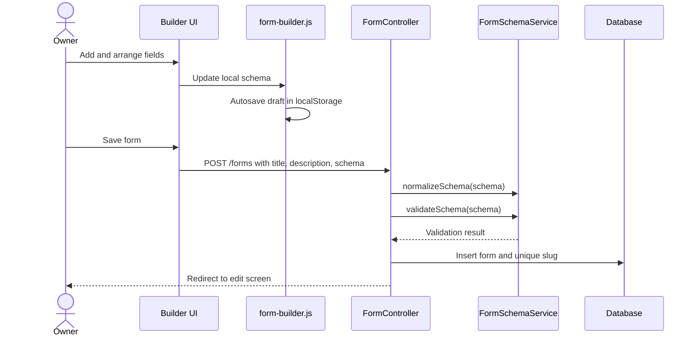
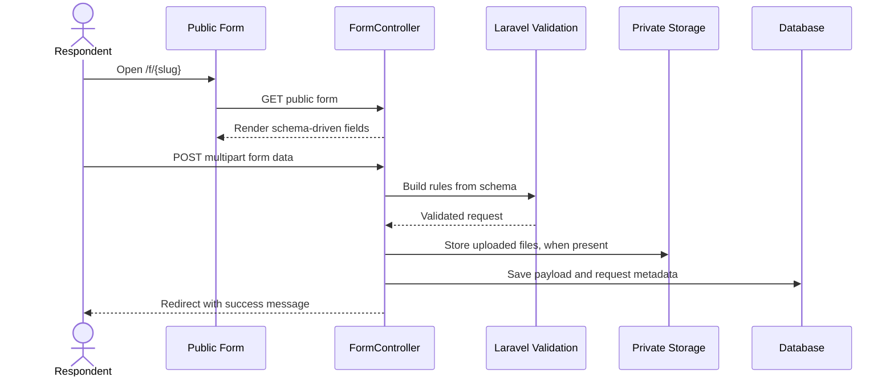
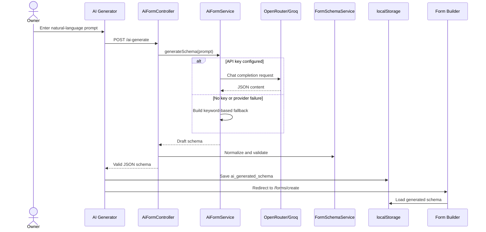
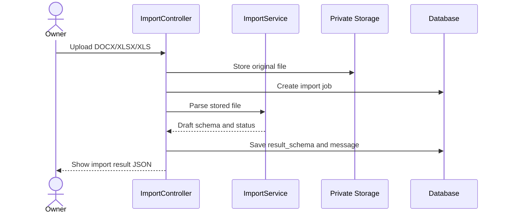
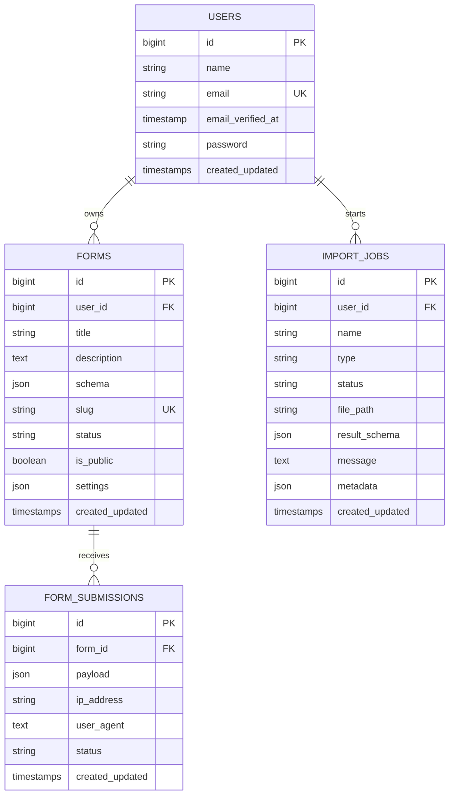

# FormPilot — AI-Powered Form Builder Assignment

FormPilot is a Laravel and Livewire form-building application created as a technical assignment. It allows authenticated users to build forms visually, publish shareable public URLs, collect responses, accept private file uploads, generate draft schemas with AI, import draft questions from Word or Excel, and review submissions from a central dashboard.

The application uses a schema-driven design: every form is stored as a JSON array of field definitions, and the same schema powers the builder preview, public respondent page, server-side validation, submission storage, and response viewer.

---

## Table of contents

1. [Current feature set](#current-feature-set)
2. [Technology stack](#technology-stack)
3. [System requirements](#system-requirements)
4. [Local installation](#local-installation)
5. [Environment configuration](#environment-configuration)
6. [Running the application](#running-the-application)
7. [Application architecture](#application-architecture)
8. [Main user flows](#main-user-flows)
9. [Form schema contract](#form-schema-contract)
10. [Submission validation and storage](#submission-validation-and-storage)
11. [AI generation strategy](#ai-generation-strategy)
12. [Import strategy](#import-strategy)
13. [Dashboard details](#dashboard-details)
14. [Routes](#routes)
15. [Database design](#database-design)
16. [Security model](#security-model)
17. [File uploads](#file-uploads)
18. [Frontend behavior](#frontend-behavior)
19. [Testing](#testing)
20. [Production deployment](#production-deployment)
21. [Troubleshooting](#troubleshooting)
22. [Current limitations](#current-limitations)
23. [Next-step roadmap](#next-step-roadmap)

---

## Current feature set

### Form builder

- Searchable field library organized into input, contact, choice, and layout field groups.
- Click-to-add and drag-to-add field creation.
- True drag-and-drop field reordering with insertion indicators.
- Live form preview inside the builder canvas.
- Contextual field inspector for labels, keys, placeholders, help text, defaults, options, required state, and upload settings.
- Duplicate, delete, move up, and move down controls.
- Undo and redo history.
- Direct JSON schema editor with formatting and validation feedback.
- Browser-based draft autosave and recovery using `localStorage`.
- Shared workspace for both form creation and editing.

### Supported field types

- Short text
- Long text
- Number
- Email
- Phone
- Date
- Dropdown
- Radio group
- Checkbox group
- Rating
- Section heading
- File upload

### Publishing and sharing

- Public and private form visibility.
- Unique public URLs in the format `/f/{slug}`.
- Share URL displayed on the main dashboard and forms list.
- One-click clipboard copy with visible success or failure feedback.
- Clipboard fallback for localhost and browsers without the modern Clipboard API.
- Private forms display a warning instead of exposing a non-working public link.

### Respondent experience

- Responsive public form page with a stable dark hero and centered response card.
- Progress indicator showing answered fields and completion percentage.
- Required-field indicators and Laravel validation messages.
- Mobile-friendly full-width form controls.
- Drag-and-drop file selection UI.
- Selected filename and file size preview.
- Submit loading state to reduce accidental duplicate submissions.
- Indian phone placeholder: `+91 98765 43210`.

> The Indian phone value is currently a placeholder only. It is not country-aware phone validation.

### Submission management

- Global submission dashboard at `/submissions`.
- Per-form submission pages.
- Total, today, current-week, and responding-form statistics.
- Filtering by form and submission status.
- Desktop table and mobile card layouts.
- Recent submissions displayed on the main dashboard.
- Owner-authorized download of uploaded files.

### AI and imports

- Natural-language form schema generation.
- OpenRouter and Groq provider support.
- Deterministic fallback schema when no API key is configured or the provider fails.
- Word `.docx` import into draft text fields.
- Excel `.xlsx` and `.xls` import from the first column into draft text fields.

### Authentication

- Registration and login.
- Password reset and password confirmation.
- Profile editing and account deletion.
- Authenticated ownership checks for forms, submissions, imports, and uploaded files.

---

## Technology stack

| Layer | Technology |
|---|---|
| Backend | PHP 8.3+, Laravel 13 |
| Interactive server UI | Livewire 4 for the dashboard component |
| Templates | Blade |
| Client-side interactions | Vanilla JavaScript and Alpine.js |
| Styling | Tailwind CSS and `@tailwindcss/forms` |
| Asset build | Vite 8 |
| Authentication | Laravel Breeze |
| Database | SQLite by default; MySQL/PostgreSQL can be configured |
| Spreadsheet import | Maatwebsite Excel / PhpSpreadsheet |
| Word import | PHPWord |
| AI HTTP integration | Laravel HTTP client |
| Testing | PHPUnit |

The project is intentionally hybrid rather than fully Livewire-driven. Livewire renders the main dashboard, while the form-builder interaction layer is handled by `resources/js/form-builder.js`. This keeps drag-and-drop interactions immediate and avoids a server round trip for every field movement.

---

## System requirements

Install the following before running the project:

- PHP `8.3` or newer.
- Composer 2.
- Node.js `20.19+` or `22.12+` because the packaged Vite version requires one of those ranges.
- npm.
- SQLite, MySQL, or PostgreSQL.

Recommended PHP extensions:

```text
ctype
dom
fileinfo
gd
iconv
json
libxml
mbstring
openssl
pdo
pdo_sqlite or pdo_mysql
simplexml
tokenizer
xml
xmlreader
xmlwriter
zip
zlib
```

The XML, ZIP, DOM, and XMLReader/XMLWriter extensions are especially important for Word and Excel imports and for the complete PHPUnit suite.

---

## Local installation

### 1. Extract and enter the project

```bash
unzip LaravelAIFormBuilder-Enhanced-v4.zip
cd LaravelAIFormBuilder-Enhanced-v4
```

### 2. Install PHP dependencies

```bash
composer install
```

### 3. Create the environment file

```bash
cp .env.example .env
```

On Windows PowerShell:

```powershell
Copy-Item .env.example .env
```

### 4. Generate the application key

```bash
php artisan key:generate
```

### 5. Configure the database

The default environment uses SQLite.

```bash
mkdir -p database
touch database/database.sqlite
```

On Windows PowerShell:

```powershell
New-Item database/database.sqlite -ItemType File -Force
```

Confirm these values in `.env`:

```dotenv
DB_CONNECTION=sqlite
```

For MySQL, replace the database section with values similar to:

```dotenv
DB_CONNECTION=mysql
DB_HOST=127.0.0.1
DB_PORT=3306
DB_DATABASE=form_builder
DB_USERNAME=root
DB_PASSWORD=
```

### 6. Run migrations

```bash
php artisan migrate
```

### 7. Install frontend dependencies

```bash
npm install
```

For reproducible CI or deployment installs, use:

```bash
npm ci
```

### 8. Build frontend assets

```bash
npm run build
```

### 9. Clear stale framework caches

```bash
php artisan optimize:clear
```

### 10. Start the application

```bash
php artisan serve
```

Open:

```text
http://127.0.0.1:8000
```

Create an account at `/register`, then open the form builder from the landing page or dashboard.

---

## Environment configuration

A practical local `.env` configuration is:

```dotenv
APP_NAME="FormPilot"
APP_ENV=local
APP_KEY=
APP_DEBUG=true
APP_URL=http://127.0.0.1:8000

DB_CONNECTION=sqlite

SESSION_DRIVER=database
CACHE_STORE=database
QUEUE_CONNECTION=database
FILESYSTEM_DISK=local

MAIL_MAILER=log
MAIL_FROM_ADDRESS="hello@example.com"
MAIL_FROM_NAME="${APP_NAME}"

AI_PROVIDER=openrouter
OPENROUTER_API_KEY=
GROQ_API_KEY=

VITE_APP_NAME="${APP_NAME}"
```

### AI provider options

Use OpenRouter:

```dotenv
AI_PROVIDER=openrouter
OPENROUTER_API_KEY=your_key_here
```

Use Groq:

```dotenv
AI_PROVIDER=groq
GROQ_API_KEY=your_key_here
```

When neither key exists, the application uses a deterministic local fallback. AI generation therefore still returns a usable draft, but it will be based on keyword matching rather than a remote language model.

### Application URL and share links

Set `APP_URL` to the real public base URL in staging and production:

```dotenv
APP_URL=https://forms.example.com
```

Share URLs are generated with Laravel's `route()` helper. An incorrect `APP_URL` can produce incorrect clipboard links in command-line jobs, emails, or cached configuration.

---

## Running the application

### Simple development mode

Use two terminals:

```bash
php artisan serve
```

```bash
npm run dev
```

### Combined development command

The Composer script starts Laravel, the queue listener, logs, and Vite together:

```bash
composer run dev
```

### Production asset build

```bash
npm run build
```

### Useful maintenance commands

```bash
php artisan optimize:clear
php artisan route:list
php artisan migrate:status
php artisan test
```

A public health endpoint is available at:

```text
/up
```

---

## Application architecture

### High-level architecture

```mermaid
flowchart LR
    Browser[Browser] --> Routes[Laravel web routes]
    Routes --> Auth[Authentication middleware]
    Routes --> Controllers[Controllers]
    Routes --> Livewire[Livewire Dashboard]

    Controllers --> SchemaService[FormSchemaService]
    Controllers --> AIService[AiFormService]
    Controllers --> ImportService[ImportService]
    Controllers --> Models[Eloquent models]
    Livewire --> Models

    Models --> DB[(Database)]
    Controllers --> PrivateStorage[(Private local storage)]

    Browser --> BuilderJS[form-builder.js]
    Browser --> RespondentJS[respondent-form.js]
    Browser --> Alpine[Alpine.js]

    BuilderJS --> SchemaValidation[/schema/validate]
    BuilderJS --> FormEndpoints[Form create/update endpoints]
    RespondentJS --> SubmitEndpoint[/f/slug/submit]
```

### Backend layers

#### Routes

`routes/web.php` separates the application into three access levels:

1. Public landing and public form routes.
2. Authenticated form-owner routes.
3. Authenticated profile routes.

The public submission endpoint is rate-limited to 30 requests per minute:

```php
Route::post('/f/{form:slug}/submit', ...)
    ->middleware('throttle:30,1');
```

#### Controllers

- `FormController` — form CRUD operations, preview, public rendering, submission handling, and private attachment downloads.
- `SubmissionController` — global response dashboard and filters.
- `AiFormController` — AI generation endpoint and generator page.
- `ImportController` — Word/Excel upload and parsing flow.
- `SchemaEditorController` — schema normalization and server validation endpoint.
- Authentication and profile controllers are provided by the Laravel Breeze structure.

#### Services

- `FormSchemaService` — normalizes fields and checks the minimum schema contract.
- `AiFormService` — selects the AI provider, sends the prompt, parses JSON, and falls back safely.
- `ImportService` — parses supported document formats into draft field arrays.

#### Models

- `User`
- `Form`
- `FormSubmission`
- `ImportJob`

#### Views

Blade templates are organized by feature:

```text
resources/views/
├── forms/
│   ├── partials/
│   │   ├── builder-workspace.blade.php
│   │   ├── respondent-field.blade.php
│   │   ├── respondent-form.blade.php
│   │   └── share-control.blade.php
│   ├── ai-create.blade.php
│   ├── builder.blade.php
│   ├── edit.blade.php
│   ├── index.blade.php
│   ├── preview.blade.php
│   ├── public.blade.php
│   └── submissions.blade.php
├── imports/
├── layouts/
├── livewire/
├── submissions/
├── dashboard.blade.php
└── welcome.blade.php
```

### Frontend architecture

```text
resources/js/app.js
├── starts Alpine.js
├── imports form-builder.js
├── imports respondent-form.js
└── provides global copy-to-clipboard behavior

resources/js/form-builder.js
├── field template registry
├── schema normalization
├── canvas renderer
├── inspector renderer
├── drag-and-drop behavior
├── undo/redo history
├── JSON editor integration
├── local draft autosave
└── client/server schema validation

resources/js/respondent-form.js
├── answered-field detection
├── progress calculation
├── file-selection feedback
├── drag-state styling
└── submit loading state
```

### Architectural principle

The JSON schema is the source of truth. The visual builder is not a separate data model; it edits the same schema eventually persisted in the `forms.schema` JSON column.

This approach makes rendering flexible and keeps new field types reasonably isolated, but it also means schema compatibility must be treated like an API contract.

---

## Main user flows

### 1. Manual form creation



### 2. Public response submission



### 3. AI-assisted creation



### 4. Document import



---

## Form schema contract

A form schema is a JSON array. Each array item represents one visual field or a non-input section heading.

### Field properties

| Property | Type | Required | Purpose |
|---|---:|---:|---|
| `type` | string | Yes | Renderer and validation type |
| `key` | string | Yes | Submission payload key and HTML input name |
| `label` | string | Yes | Visible question or section title |
| `required` | boolean | No | Adds browser and server required validation |
| `placeholder` | string | No | Input placeholder or select prompt |
| `help_text` | string | No | Supporting respondent guidance |
| `default` | string/array | No | Initial field value |
| `options` | array | Choice fields | Dropdown, radio, checkbox, or rating values |
| `validations` | array | No | Metadata used by the builder/AI contract |
| `accepted_file_types` | string | File fields | Browser `accept` value, such as `.pdf,.docx` |
| `max_file_size_mb` | integer | File fields | Upload limit clamped between 1 and 50 MB |

### Key rules

The builder enforces the following rules before saving:

- Keys use lowercase letters, numbers, and underscores.
- Keys must be unique inside a form.
- Labels and keys cannot be empty.
- Choice fields require at least one option.
- At least one field must exist.

The backend currently performs the minimum contract check for `type`, `key`, and `label`, then normalizes missing defaults. Strengthening server-side whitelist and uniqueness validation is listed in `decision.md`.

### Complete example

```json
[
  {
    "type": "section_heading",
    "key": "contact_section",
    "label": "Contact information",
    "required": false,
    "placeholder": "",
    "help_text": "Tell us how to reach you.",
    "default": "",
    "options": [],
    "validations": []
  },
  {
    "type": "text",
    "key": "full_name",
    "label": "Full name",
    "required": true,
    "placeholder": "Enter your full name",
    "help_text": "Use the name shown on your ID.",
    "default": "",
    "options": [],
    "validations": ["required"]
  },
  {
    "type": "phone",
    "key": "mobile_number",
    "label": "Mobile number",
    "required": true,
    "placeholder": "+91 98765 43210",
    "help_text": "Include the country code.",
    "default": "",
    "options": [],
    "validations": ["required"]
  },
  {
    "type": "dropdown",
    "key": "department",
    "label": "Department",
    "required": true,
    "placeholder": "Select a department",
    "help_text": "",
    "default": "",
    "options": ["Design", "Engineering", "Marketing"],
    "validations": ["required"]
  },
  {
    "type": "file",
    "key": "resume",
    "label": "Resume",
    "required": false,
    "placeholder": "",
    "help_text": "Upload a PDF or DOCX file.",
    "default": "",
    "options": [],
    "validations": ["file"],
    "accepted_file_types": ".pdf,.docx",
    "max_file_size_mb": 10
  }
]
```

### Supported type behavior

| Type | HTML behavior | Server validation |
|---|---|---|
| `text` | Text input | Nullable/required string, max 2,000 chars |
| `textarea` | Multi-line textarea | Nullable/required string, max 10,000 chars |
| `number` | Number input | Numeric |
| `email` | Email input | Email, max 255 chars |
| `phone` / `tel` | Telephone input | String, max 50 chars |
| `date` | Date input | Date |
| `dropdown` / `select` | Select list | String and `Rule::in(options)` |
| `radio` | Single radio choice | String and `Rule::in(options)` |
| `checkbox` | Multiple checkboxes | Array; each item constrained to options |
| `rating` | Single rating value | String and `Rule::in(options)` |
| `file` / `upload` / `file_upload` | File picker/drop zone | File with schema-defined max size |
| `section_heading` | Informational heading | Not submitted |

---

## Submission validation and storage

### Dynamic validation

`FormController::submissionValidationRules()` builds Laravel validation rules at request time from the saved form schema.

This prevents a respondent from bypassing the browser UI and submitting arbitrary option values for dropdowns, radio buttons, ratings, or checkboxes.

### Submission payload

Normal answers are stored in the `form_submissions.payload` JSON column:

```json
{
  "full_name": "Aarav Sharma",
  "mobile_number": "+91 98765 43210",
  "department": "Engineering",
  "skills": ["Frontend", "Communication"]
}
```

Uploaded files are represented by metadata rather than raw binary data:

```json
{
  "resume": {
    "kind": "file",
    "disk": "local",
    "path": "form-submissions/42/random-file-name.pdf",
    "original_name": "Aarav-Sharma-Resume.pdf",
    "mime_type": "application/pdf",
    "size": 248321
  }
}
```

### Request metadata

Each submission currently stores:

- `form_id`
- JSON payload
- IP address
- User agent
- Status, defaulting to `submitted`
- Creation and update timestamps

Review privacy and retention requirements before using IP addresses in production.

---

## AI generation strategy

### Current provider selection

`AiFormService` reads:

```dotenv
AI_PROVIDER=openrouter
OPENROUTER_API_KEY=
GROQ_API_KEY=
```

Provider behavior:

| Provider | Endpoint | Current model |
|---|---|---|
| OpenRouter | OpenAI-compatible chat completions | `openai/gpt-4o-mini` |
| Groq | OpenAI-compatible chat completions | `llama-3.1-8b-instant` |

The request timeout is 30 seconds and temperature is `0.2` to reduce unnecessary variation.

### Prompt contract

The system instruction tells the model to act as a senior form-design assistant and return only a JSON object containing a `schema` array. It also supplies the supported field whitelist and the expected properties for every field.

Conceptually, the prompt is:

```text
Role:
You are a senior form design assistant.

Output contract:
Return only one JSON object containing a schema array.
Do not include Markdown, explanation, or commentary.

Supported field types:
text, textarea, number, email, phone, date, dropdown,
radio, checkbox, file, section_heading, rating

Required field keys:
type, key, label, required, placeholder, help_text,
default, options, validations

Quality requirements:
- Use concise labels.
- Use stable snake_case keys.
- Add options only for choice fields.
- Avoid unnecessary questions.
- Keep the schema valid and reasonably short.
```

For edit mode, the existing schema is included before the user's requested changes.

### AI response pipeline

1. Receive `prompt`, optional `mode`, and optional `form_id`.
2. Load the existing schema when edit mode references a form.
3. Call the configured provider when a key exists.
4. Read `choices[0].message.content`.
5. Decode JSON.
6. Accept either a `schema` key or a `fields` key.
7. Normalize the array with `FormSchemaService`.
8. Validate the minimum schema contract.
9. Return the normalized schema to the browser.
10. Store the generated schema in `localStorage` when the user chooses **Use in builder**.
11. Redirect to the standard builder, which consumes the stored schema.

### Safe fallback strategy

When the API key is missing, the provider request fails, or the returned content is not valid JSON, the service creates a deterministic schema using prompt keywords.

Current keyword behavior includes:

- `email` → email field
- `phone` → phone field with Indian placeholder
- `resume`, `cv`, or `upload` → file field
- `skill` → checkbox field
- `education` or `degree` → education textarea

The fallback always includes a name field and an additional-notes field. In edit mode, it keeps the existing schema and appends an additional-details field.

### Example prompts

```text
Create a job application form with full name, email, Indian mobile number,
current city, years of experience, skills, resume upload, and availability.
```

```text
Build a customer feedback form with a 1-to-5 rating, service category,
comments, and permission to contact the customer.
```

```text
Create an event registration form with attendee details, session choices,
dietary preferences, accessibility requirements, and optional notes.
```

### Production prompt recommendations

The next implementation should add:

- Provider-native structured JSON output when supported.
- A strict server-side field-type whitelist.
- Unique-key validation on the backend.
- Markdown-fence removal before JSON decoding.
- One controlled repair attempt for malformed JSON.
- Maximum field count and prompt length limits.
- Provider/model settings in `config/services.php` rather than direct `env()` access inside the service.
- Logging of provider, model, latency, and failure category without logging sensitive respondent data.

These decisions are prioritized in `decision.md`.

---

## Import strategy

### Supported files

- `.docx`
- `.xlsx`
- `.xls`

### Current Word behavior

`ImportService::parseDocx()` loads the document with PHPWord, walks section elements, and converts elements exposing `getText()` into text fields:

```json
{
  "type": "text",
  "key": "field_1",
  "label": "Question text from the document",
  "required": false
}
```

### Current spreadsheet behavior

`ImportService::parseXlsx()` loads the active sheet, skips the first row, and uses the first column of each later non-empty row as a text-field label.

A compatible sheet can look like:

| Field label |
|---|
| Full name |
| Email address |
| Phone number |
| Additional comments |

### Import job lifecycle

The uploaded source file is stored on the private local disk. An `import_jobs` row records:

- Owner
- Original name
- Type
- Status
- Private file path
- Generated schema
- Result message
- Metadata

The current parsing work runs synchronously during the request. The queue configuration exists, but imports are not yet dispatched to background jobs.

### Current import limitation

The result page shows generated JSON, but it does not yet send the imported schema directly into the visual builder. That integration is a high-priority next step.

---

## Dashboard details

The application contains three related owner dashboards.

### Main dashboard — `/dashboard`

Implemented as `App\Livewire\Dashboard`.

Summary cards:

- Total forms owned by the signed-in user.
- Total submissions across owned forms.
- Submissions received today.
- Total import jobs.

Recent forms section:

- Latest 8 forms.
- Public/private badge.
- Description summary.
- Submission count.
- Last updated time.
- Preview and edit links.
- Public URL and copy button for public forms.
- Private-state guidance for private forms.

Latest submissions section:

- Latest 5 submissions across owned forms.
- Form title.
- Relative submission time.
- Direct link to the per-form response card.

### Forms dashboard — `/forms`

- Paginated list of owned forms, 10 per page.
- Submission count per form.
- Public/private state.
- Preview and edit actions.
- Visible share URL for public forms.
- One-click copy behavior.

### Global submission dashboard — `/submissions`

Summary cards:

- Total submissions.
- Submissions today.
- Submissions this week.
- Number of forms that have received at least one response.

Filtering:

- Filter by owned form.
- Filter by status.
- Preserve filters through pagination.
- Reset active filters.

Desktop layout:

- Submission ID.
- Form title.
- Count of answered fields.
- Submission date and time.
- Status badge.
- Link to the full response.

Mobile layout:

- Compact response cards.
- Form title and timestamp.
- Status.
- Answered-field count.
- Direct response link.

Pagination uses 15 submissions per page.

### Per-form submissions — `/forms/{form}/submissions`

- Owner-only access.
- Paginated submissions, 10 per page.
- Schema labels mapped to stored payload values.
- File answers shown as authorized download links.
- Response cards addressable by an anchor such as `#submission-123`.

### Ownership boundary

Every dashboard query is scoped to the authenticated user's forms. The global submission dashboard uses `whereHas('form', ...)` so responses from another owner are not returned.

---

## Routes

### Public routes

| Method | Route | Name | Purpose |
|---|---|---|---|
| GET | `/` | — | Assignment landing page |
| GET | `/f/{slug}` | `forms.public` | Public respondent form |
| POST | `/f/{form:slug}/submit` | `forms.submit` | Store a public response; throttled |
| GET | `/up` | — | Laravel health endpoint |

### Authenticated form-owner routes

| Method | Route | Name | Purpose |
|---|---|---|---|
| GET | `/dashboard` | `dashboard` | Main owner dashboard |
| GET | `/forms` | `forms.index` | Forms list |
| GET | `/forms/create` | `forms.create` | New form builder |
| GET | `/forms/builder` | `forms.builder` | Builder view alias |
| POST | `/forms` | `forms.store` | Create a form |
| GET | `/forms/{form}/edit` | `forms.edit` | Edit builder |
| PUT | `/forms/{form}` | `forms.update` | Update a form |
| GET | `/forms/{form}/preview` | `forms.preview` | Owner/public preview |
| GET | `/forms/{form}/submissions` | `forms.submissions` | Per-form responses |
| GET | `/forms/{form}/submissions/{submission}/files/{field}` | `forms.submissions.files.download` | Authorized file download |
| GET | `/forms/{form}/share` | `forms.share` | Compatibility redirect to public form |
| GET | `/submissions` | `submissions.index` | Global response dashboard |
| GET | `/ai-form` | `ai.form` | AI generator UI |
| POST | `/ai-generate` | `ai.generate` | Generate and validate a schema |
| POST | `/schema/validate` | `schema.validate` | Validate builder schema |
| GET | `/imports` | `imports.create` | Import upload page |
| POST | `/imports` | `imports.store` | Parse uploaded document |
| GET | `/imports/{job}` | `imports.show` | Show import result |

Authentication and profile routes are defined in `routes/auth.php` and the authenticated profile route group.

---

## Database design

### Entity relationship diagram



### Forms table

Important fields:

- `user_id` — owner.
- `schema` — JSON field array.
- `slug` — unique public identifier.
- `status` — currently defaults to `draft`.
- `is_public` — controls public access.
- `settings` — JSON extension point.

Current settings written when a form is created:

```json
{
  "allow_csv_export": true,
  "allow_ai_import": true
}
```

These are currently reserved flags. CSV export is not yet implemented.

Indexes:

- Composite index on `user_id` and `status`.
- Unique slug constraint plus an explicit slug index.

### Form submissions table

Indexes:

- Composite index on `form_id` and `created_at`.
- Status index.

Deleting a form cascades to its submission database rows. A future cleanup process should also delete associated private files.

### Import jobs table

Index:

- Composite index on `user_id` and `status`.

---

## Security model

### Authentication and authorization

- Builder, forms list, global submissions, AI generation, imports, and profile pages require authentication.
- Form edit, update, per-form submissions, and attachment download methods verify ownership.
- Import result pages verify job ownership.
- Global response queries are scoped to forms owned by the active user.

Authorization is currently implemented with explicit `abort_unless(...)` checks. Laravel Policies are recommended for the next iteration to centralize ownership logic.

### Public form visibility

A public form is loaded only when:

```php
Form::where('slug', $slug)
    ->where('is_public', true)
    ->firstOrFail();
```

The slug is an address, not an access secret. Anyone with the URL can open a public form.

### Submission protection

- CSRF protection applies to web submissions.
- Laravel validation is generated from the stored schema.
- Choice values are constrained with `Rule::in()`.
- Public submission requests are throttled to 30 per minute.
- Uploaded files are not placed in the public web directory.
- Download routes verify both form ownership and submission membership.
- Stored file paths must begin with the expected form-specific directory.

### HTML safety

Blade escapes labels, help text, option values, and respondent answers by default. Builder-generated preview markup uses an explicit HTML-escape helper for schema values inserted by JavaScript.

### Recommended production improvements

- Convert ownership checks to Policies.
- Add CAPTCHA or a honeypot for public forms.
- Add stricter file MIME/extension validation.
- Add malware scanning for uploaded documents.
- Define submission and file retention policies.
- Avoid retaining full IP addresses unless required.
- Add Content Security Policy headers.
- Add audit logs for form publication and data export.

---

## File uploads

### Storage location

The configured `local` disk points to:

```text
storage/app/private
```

Submission files are stored below:

```text
storage/app/private/form-submissions/{form_id}/
```

Import source documents are stored below:

```text
storage/app/private/imports/
```

No `php artisan storage:link` command is required for these private files.

### Upload size

Each file field can define `max_file_size_mb`. The application clamps this between 1 and 50 MB and converts it to Laravel's kilobyte-based `max` rule.

Your PHP server limits must be at least as large as the biggest form field limit:

```ini
upload_max_filesize = 50M
post_max_size = 55M
max_file_uploads = 20
```

Restart PHP-FPM, Apache, or the relevant web server after changing `php.ini`.

### Accepted file types

`accepted_file_types` currently controls the browser's `accept` attribute. It improves the file picker but must not be treated as a security boundary. Add server-side MIME and extension rules before accepting sensitive uploads in production.

---

## Frontend behavior

### Builder draft storage

The builder saves a draft payload to `localStorage`. The payload contains the current form title, description, public state, schema, and save timestamp.

On load, the builder compares the local draft timestamp with the server update timestamp and can restore a newer unsaved draft.

Local drafts are browser- and device-specific. They are not synchronized between devices.

### Undo and redo

Schema snapshots are serialized before mutations. Undo restores the previous snapshot; redo restores a snapshot removed by undo. Property edits are grouped from focus to blur rather than creating a history entry for every keystroke.

### Drag and drop

The builder uses HTML Drag and Drop with custom transfer types:

- `application/x-form-field` for a new field dragged from the library.
- `application/x-form-index` for an existing canvas field.

The drop position is calculated from the pointer's vertical position relative to rendered field cards.

### Clipboard behavior

`resources/js/app.js` first attempts:

```js
navigator.clipboard.writeText(url)
```

When that API is unavailable, it creates a temporary textarea and uses `document.execCommand('copy')` as a compatibility fallback.

### Respondent progress

`respondent-form.js` considers a field answered when:

- Text, textarea, number, email, phone, date, or select has a non-empty value.
- A radio or rating option is checked.
- At least one checkbox option is checked.
- A file field contains a selected file.

Section headings are not counted as response fields.

---

## Testing

Run the test suite:

```bash
php artisan test
```

Run a specific file:

```bash
php artisan test tests/Feature/SubmissionDashboardTest.php
```

Run a single test by name:

```bash
php artisan test --filter=phone_fields_use_the_india_placeholder
```

Current custom coverage includes:

- Global submission dashboard ownership scoping.
- Share URL visibility on the forms list.
- Indian phone placeholder rendering.
- Valid and invalid schema service behavior.
- Standard authentication, password, registration, verification, and profile flows.

Recommended additional tests:

- Form create/update authorization.
- Anonymous public submission.
- Private form rejection.
- Every field type's validation mapping.
- Checkbox option tampering.
- File upload storage and owner-only download.
- File download path traversal protection.
- Public submission throttling.
- AI provider success, malformed JSON, timeout, and fallback behavior using `Http::fake()`.
- Import ownership and parsing failures.
- Browser tests for drag-and-drop, autosave, clipboard feedback, and mobile layout.

Code style can be checked with Laravel Pint:

```bash
./vendor/bin/pint --test
```

Apply formatting:

```bash
./vendor/bin/pint
```

---

## Production deployment

### 1. Production environment

```dotenv
APP_NAME="FormPilot"
APP_ENV=production
APP_DEBUG=false
APP_URL=https://forms.example.com

SESSION_SECURE_COOKIE=true
LOG_LEVEL=warning
```

Use strong database credentials and configure a real mail provider if password reset emails must be delivered.

### 2. Install optimized dependencies

```bash
composer install --no-dev --prefer-dist --optimize-autoloader
npm ci
npm run build
```

### 3. Run migrations

```bash
php artisan migrate --force
```

### 4. Set permissions

The web-server user must be able to write to:

```text
storage/
bootstrap/cache/
```

### 5. Cache framework configuration

```bash
php artisan config:cache
php artisan route:cache
php artisan view:cache
```

After changing `.env`, clear and rebuild caches:

```bash
php artisan optimize:clear
php artisan config:cache
php artisan route:cache
php artisan view:cache
```

### 6. Configure HTTPS

Clipboard behavior is most reliable in a secure browser context. Production should use HTTPS.

### 7. Configure PHP upload limits

Match PHP and reverse-proxy limits to the form upload limit. For Nginx, also review `client_max_body_size`.

### 8. Optional queue worker

The project uses the database queue configuration by default, but current AI and import operations execute synchronously. A worker becomes necessary after those operations are moved into jobs:

```bash
php artisan queue:work --tries=3
```

---

## Troubleshooting

### Blank or unstyled pages

```bash
npm install
npm run build
php artisan optimize:clear
```

Confirm `public/build/manifest.json` exists after the build.

### Vite development assets not loading

Run:

```bash
npm run dev
```

Keep the Vite process running while developing.

### SQLite database error

Create the file and rerun migrations:

```bash
touch database/database.sqlite
php artisan migrate
```

### `Class not found` after replacing files

```bash
composer dump-autoload
php artisan optimize:clear
```

### Public URL is incorrect

Update:

```dotenv
APP_URL=http://127.0.0.1:8000
```

Then run:

```bash
php artisan optimize:clear
```

### File field appears but uploads fail

Check all of the following:

- The form contains `enctype="multipart/form-data"`.
- `upload_max_filesize` is large enough.
- `post_max_size` is larger than the upload.
- `storage/app/private` is writable.
- The selected file is within the field's `max_file_size_mb` limit.

### Word or Excel import fails

Confirm these PHP extensions are enabled:

```text
dom
fileinfo
libxml
simplexml
xml
xmlreader
xmlwriter
zip
```

### AI always returns the fallback

Check the provider and key:

```dotenv
AI_PROVIDER=openrouter
OPENROUTER_API_KEY=...
```

or:

```dotenv
AI_PROVIDER=groq
GROQ_API_KEY=...
```

Then clear cached configuration:

```bash
php artisan optimize:clear
```

Also check `storage/logs/laravel.log` for provider request errors.

### Clipboard copy fails

Use HTTPS in production. On localhost, the application attempts a legacy copy fallback. The URL remains visible and selectable even when automatic copy is unavailable.

---

## Current limitations

The following items are not complete and should not be presented as finished features:

- No form delete endpoint or duplicate-form backend action.
- No CSV/Excel submission export, despite the reserved `allow_csv_export` setting.
- No dedicated single-submission route; the global dashboard links to a response anchor on the per-form page.
- No conditional fields, page branching, or multi-step forms.
- No form templates library.
- No collaboration, teams, roles, or organization tenancy.
- No submission email notifications or webhooks.
- No scheduled closing date or response quota.
- No CAPTCHA, honeypot, or bot scoring.
- Phone fields use a placeholder but not international phone-number validation.
- Browser `accept` values are not yet mirrored by strict server MIME rules.
- Uploaded files are not malware-scanned.
- Deleting a form cascades database submissions but there is no implemented form-delete flow or explicit attachment cleanup job.
- AI response parsing expects clean JSON and does not yet repair fenced or partially malformed output.
- AI provider settings are read directly from `env()` inside the service.
- Import parsing is basic and synchronous.
- Imported schemas are displayed as JSON rather than passed directly to the builder.
- Dashboard analytics are counts only; no trend charts, completion rates, or field-level analysis.
- Automated browser testing is not present.

This is a strong assignment-level MVP, not yet a full Typeform/Jotform replacement. The clean path forward is documented in `decision.md`.

---

## Next-step roadmap

See [`DECISION.md`](dDECISION.md) for a prioritized two-week implementation plan, architectural decisions, acceptance criteria, risks, and explicit out-of-scope items.

---

## License

This project is based on the Laravel application skeleton, which is released under the MIT License. Confirm licensing requirements for all third-party packages and any assignment-specific code before redistribution.
